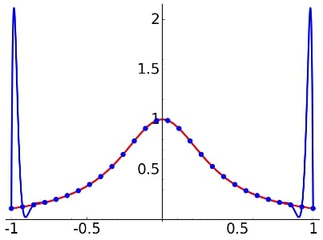

# Newton-Cotes Quadrature

## Table of Contents

- [Overview](#overview)
- [Background](#background)
- [Implementation of Newton-Cotes Quadrature](#implementations-of-newton-cotes-quadrature)
- [Extending to Composite Quadrature](#extending-to-composite-quadrature)
- [References](#references)

## Overview

The Newton-Cotes Quadrature or Newton-Cotes Formulae are a type of a broader class of algorithms known as *numerical quadrature*, which aim to approximate the results of definite integrals. These algorithms are essential for functions $f(x)$ that do not have an antiderivative $F(x)$, which would prevent the application of the Fundamental Theorem of Calculus $I(f) = \int_a^b f(x)dx = F(b) - F(a)$ to compute definite integrals [1]. For example, the Gaussian Function, $e^{-x^2}$, is known not to have an antiderivative; however, computing its definite integral is essential in probability and statistics [2].

## Background

Numerical quadrature algorithms function by what are known as *quadrature rules*. These rules aim to replace the integral with the summation of the product between the integrand evaluated at each *quadrature node* $x_i$ and a corresponding *quadrature weight*, $w_i$ [3].
$$\int_a^b f(x) dx \approx \sum_{i = 1}^n f(x_i)w_i$$
By convention, the quadrature nodes or abscissas maintain the relationship $a\leq x_1 < \cdots < x_n \leq b$. Further, the quadrature rule is closed only if $x_1 = a$ and $x_2 = b$; otherwise, it is open [1].

### Motivating Example

Consider the Reimann Sum that defines a definite integral. The Reimann Sum only approximates a definite integral when truncated to evaluate a finite amount of points and establishes the form
$$\int_a^b f(x)dx \approx R(f) = \sum_{i=1}^n (x_{i+1} - x_i) f(x_i)$$
when considering the left-side sum. By definition of quadrature rules, the Reimann Sum is a form of numerical quadrature. Visually, the Left Reimann Sum of some function $f(x)$ on six quadrature points is [4]:

### Deriving Quadrature Rules

Quadrature rules are differentiated by how quadrature weights and nodes are selected. Interpolation is fitting a curve to a data set or simplifying a complex function to one easier to work on [1]. Interpolation is similar to the method of least squares. However, there is the additional constraint that the curve passes through every point, as is the case below for data sets with two to five points [6]. 

Interpolating a function $f$ over $n$ predefined nodes defines a polynomial function $p$ of degree $n-1$ that approximates the definite integral of $f$ over the same bounds, that is [5]:
$$\int_a^b f(x)dx \approx \int_a^b p(x) dx$$
Multiple methods are applied in practice to determine these interpolatory quadratures. One may choose a widely accepted quadrature rule, such as the Lagrangian. Alternatively, one may do so by *method of undetermined coefficients*. The method of undetermined coefficients aims to determine the interpolating polynomial by solving a system of equations [7]:
$$w_1 + \cdots + w_n = \int_a^b 1dx$$
$$x_1w_1 + \cdots + x_nw_n = \int_a^b xdx$$
$$\vdots$$
$$x_1^{n-1}w_1 + \cdots + x_n^{n-1}w_n = \int_a^b x^{n-1}dx$$
Solving this system of linear equations returns a set of quadrature weights, leaving only the trivial computation of the quadrature rule summation.

These methods of computing different quadrature rules are sufficient for understanding how the Newton-Cotes quadrature rules are derived and when they perform the best.

## Implementations of Newton-Cotes Quadrature

### Defining Features

The Newton-Cotes quadrature rule differentiates itself from most other quadrature rules by evenly spacing each abscissa on the integration interval $[a,b]$ [1]. The quadrature weights can then be found by interpolating $f$ on the $n$ nodes or applying the method of undetermined coefficients. As such, the only consideration for different forms of the Newton-Cotes quadrature rule is the number of nodes and whether the quadrature rule is open or closed. There are several common Newton-Cotes quadrature rules, and are also the most straightforward cases. Those cases are the midpoint, trapezoid, and Simpson's rules. Other rules exist and have their uses, but they also have weaknesses that make them appear useless. 

### Midpoint Rule

The midpoint rule is a one-point open rule through the integration interval's midpoint, $(a + b)/2$. A closed-form expression for the result of the quadrature is [1]:
$$M(f) = (b-a)f(\frac{a+b}{2})$$
This result is derivable using the method of undetermined coefficients in one dimension: solving $w_1 = \int_a^b 1 dx$ for $w_1$. 

### Trapezoid Rule

The trapezoid rule is a two-point closed rule where the two points are only the beginning and end of the integration interval $a$ and $b$. A closed-form expression for the result of the quadrature is [1]:
$$T(f) = \frac{b-a}{2}(f(a) + f(x))$$
Similar to the midpoint rule, this result is derivable from the method of undetermined coefficients. However, in this case, two weights are solved for, but they are equivalent. 

### Simpson's Rule

Simpson's rule is a three-point closed rule where the points are the beginning, midpoint, and end of the integration interval. A closed-form expression for the result of the quadrature is [1]:
$$S(f) = \frac{b-a}{6}(f(a) + 4f(\frac{a+b}{2}) + f(b))$$
Like the other rules, Simpson's rule is derivable by undetermined coefficients. Simpson's rule finds the interpolated polynomial to be quadratic and would appear similar to below [12]:

### Higher Orders

The use of higher-order polynomials requires there to be more quadrature nodes to interpolate. However, the defining feature of Newton-Cotes quadrature becomes a weakness as the number of points grows. *Runge's phenomenon* states that when using polynomial interpolation on equally spaced data points, the polynomial may suffer from severe oscillations around the bounds [9]. Runge's phenomenon graphically appears as below where the red curve is the original function, and the blue curve is the interpolated function [10].  

For Newton-Cotes, this means that increasing the number of abscissa does not necessarily improve the accuracy and may increase error. Further, it is the case that as the number of nodes increases to infinity, the problem becomes worse-conditioned and less stable [1]. This shortcoming implies the need for other quadrature rules that attain higher accuracy and approach the exact result as the number of quadrature points increases.

### Alternative Quadrature Rules

Other rules, such as Gaussian or Clenshaw-Curtis quadratures, perform much better than Newton-Cotes quadrature rules [1]. Sermutlu showed that it is the case that Gaussian quadrature has a lower relative error than Newton-Cotes quadrature for all input functions and number of interpolation points that he tested [13]. These rules outperform Newton-Cotes as they are not susceptible to Runge's phenomenon. They do this by picking the quadrature points more optimally and similarly interpolating the function. Since these quadrature rules become more efficient as the number of interpolation points grows, unlike for Newton-Cotes, a different method of improving Newton-Cotes is necessary. 

### Best Performance of Newton-Cotes

Newton-Cotes rarely outperforms more sophisticated quadrature rules on the same number of nodes. However, there are cases where Newton-Cotes is a better choice. As stated, Newton-Cotes is better suited for a small number of points and does not necessarily become more accurate as the number of points grows. The upside is that it is effortless to compute the result of a Newton-Cotes quadrature rule since they are well-defined and the nodes are trivially calculable. The efficiency of Newton-Cotes makes it an ideal choice for *composite quadrature* rules [8]. Composite quadrature rules aim to subdivide the integration interval into many intervals and then apply a rule to each. Though composite quadrature rules may use other quadrature rules, Newton-Cotes is comparatively efficient.

### Limitations of Numerical Quadrature

Newton-Cotes quadrature and numerical quadrature have limitations that require different approaches to solve. Those include improper integrals (when either bound goes to infinity), discontinuous functions, and multiple integrals of multivariate functions [1]. It is possible to use numerical quadrature methods for these, but they require the processes to be heavily modified.

## Extending to Composite Quadrature

Composite quadrature rules break the integration interval into smaller subintervals. A quadrature rule applied to each subinterval and summed together is approximate to the integral in the same manner as a quadrature rule applied over the entire interval at once. Composite quadrature is a means to increase the accuracy of Newton-Cotes quadrature [11]. Due to Runge's phenomenon, this is the only way to increase the accuracy of Newton-Cotes quadrature without making the problem more poorly conditioned.

Composite quadrature rules typically divide the interval into $k$ subintervals of length $h$ [1]. This convention implies that a quadrature rule must only be applied $k$ times, adding only a linear amount of work in $k$ to improve accuracy considerably. 

## References
