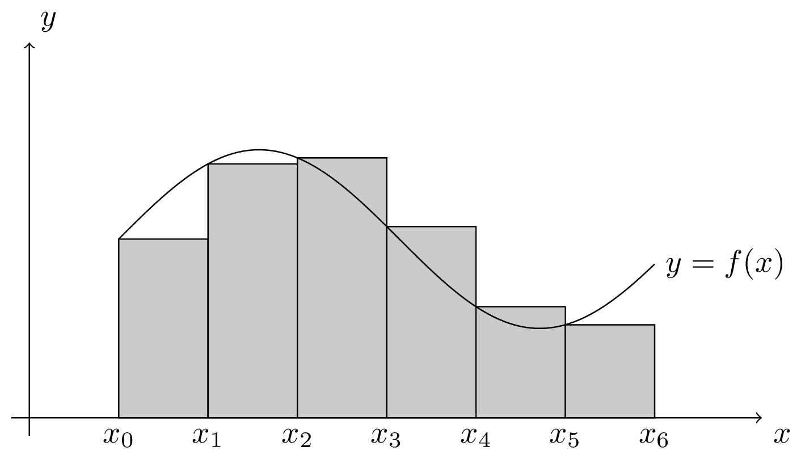
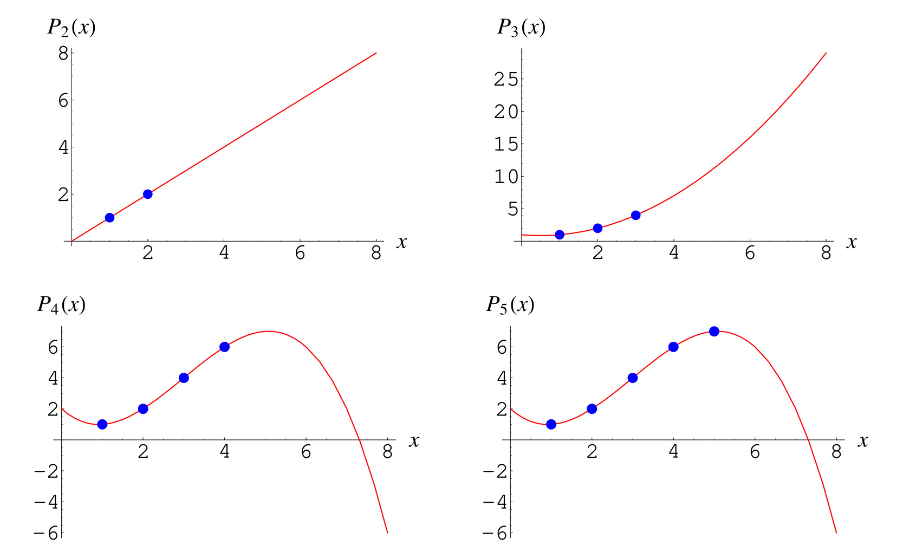

# Newton-Cotes Quadrature

## Table of Contents

- [Overview](#overview)
- [Background](#background)
- [References](#references)

## Overview

The Newton-Cotes Quadrature or Newton-Cotes Formulae are a type of a broader class of algorithms known as numerical quadrature, which aim to approximate the results of definite integrals. These algorithms are essential for functions $f(x)$ that do not have an antiderivative $F(x)$, which would prevent us from applying the Fundamental Theorem of Calculus $I(f) = \int_a^b f(x)dx = F(b) - F(a)$ to compute definite integrals [1]. For example, the Gaussian Function, $e^{-x^2}$, is known not to have an antiderivative; however, computing its definite integral is essential in probability and statistics [2].

## Background

Numerical quadrature algorithms function by what are known as quadrature rules. These rules aim to replace the integral with the summation of the product between the integrand evaluated at each quadrature point $x_i$ and a corresponding quadrature weight, $w_i$ [3].
$$\int_a^b f(x) dx \approx \sum_{i = 1}^n f(x_i)w_i$$
By convention, the quadrature points or abscissas maintain the relationship $a\leq x_1 < \cdots < x_n \leq b$. Further, the quadrature rule is closed only if $x_1 = a$ and $x_2 = b$; otherwise, it is open [1].

### Motivating Example

Consider the Reimann Sum that defines a definite integral. The Reimann Sum only approximates a definite integral when truncated to evaluate a finite amount of points and establishes the form
$$\int_a^b f(x)dx \approx R(f) = \sum_{i=1}^n (x_{i+1} - x_i) f(x_i)$$
when considering the left-side sum. By definition of quadrature rules, the Reimann Sum is a form of numerical quadrature. Visually, the Left Reimann Sum of some function $f(x)$ on six quadrature points is [4]:

### Deriving Quadrature Rules

Quadrature rules are differentiated by how quadrature weights and nodes are selected. Interpolation is fitting a curve to a data set or simplifying a complex function to one easier to work on [1]. Interpolation is similar to the method of least squares. However, there is the additional constraint that the curve passes through every point as below [6]: 

Interpolating a function $f$ over $n$ predefined nodes defines a polynomial function $p$ of degree $n-1$ that approximates the definite integral of $f$ over the same bounds, that is [5]:
$$\int_a^b f(x)dx \approx \int_a^b p(x) dx$$
Multiple methods are applied in practice to determine these interpolatory quadratures. One may choose a widely accepted quadrature rule, such as the Lagrangian. Alternatively, one may do so by *method of undetermined coefficients*. The method of undetermined coefficients aims to determine the interpolating polynomial by solving a system of equations [7]:
$$w_1 + \cdots + w_n = \int_a^b 1dx$$
$$x_1w_1 + \cdots + x_nw_n = \int_a^b xdx$$
$$\vdots$$
$$x_1^{n-1}w_1 + \cdots + x_n^{n-1}w_n = \int_a^b x^{n-1}dx$$
Solving this system of linear equations returns a set of quadrature weights, leaving only the trivial computation of the quadrature rule summation.

## Implementations of Newton-Cotes Quadrature

### Defining Features

The Newton-Cotes quadrature rule differentiates itself from most other quadrature rules by evenly spacing each abscissa on the integration interval $[a,b]$ [source tbd]. The quadrature weights can then be found by interpolating $f$ on the $n$ nodes or applying the method of undetermined coefficients. As such, the only consideration for different forms of the Newton-Cotes quadrature rule is the number of nodes and whether the quadrature rule is open or closed. There are several common Newton-Cotes quadrature rules, and are also the most straightforward cases. Those cases are the midpoint, trapezoid, and Simpson's rules.

### Midpoint Rule

### Trapezoid Rule

### Simpson's Rule

### Higher Orders

## Shortcomings of Newton-Cotes and Alternate Methods

## Handling Edge Cases

## Extending to Composite Quadrature

## References
